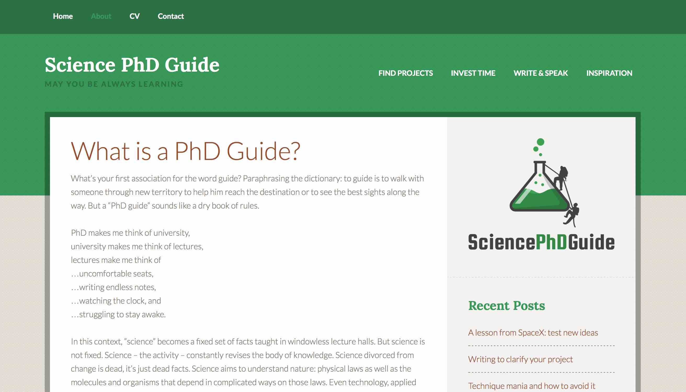

[Home](index.html) /
[Research](research.html) /
[Catalogs](catalogs.html) /
[Curriculum Vitae](cvitae.html) /
[Publications](publications.html) /
**Blog**

***

# Science PhD Guide

**My blog is currently down as I work on switching hosting providers. Check back later!**

I write a blog with research tips for science PhD students, sciencephdguide.com.
On this site I describe some of the research skills that were most helpful during my own PhD.
These are grouped into a few categories covering the usually untaught skills of finding good research topics,
sharing your research results through writing and speaking.
Other articles cover strategies for investing time rather than squandering it, reviews of books, or common PhD problems.

