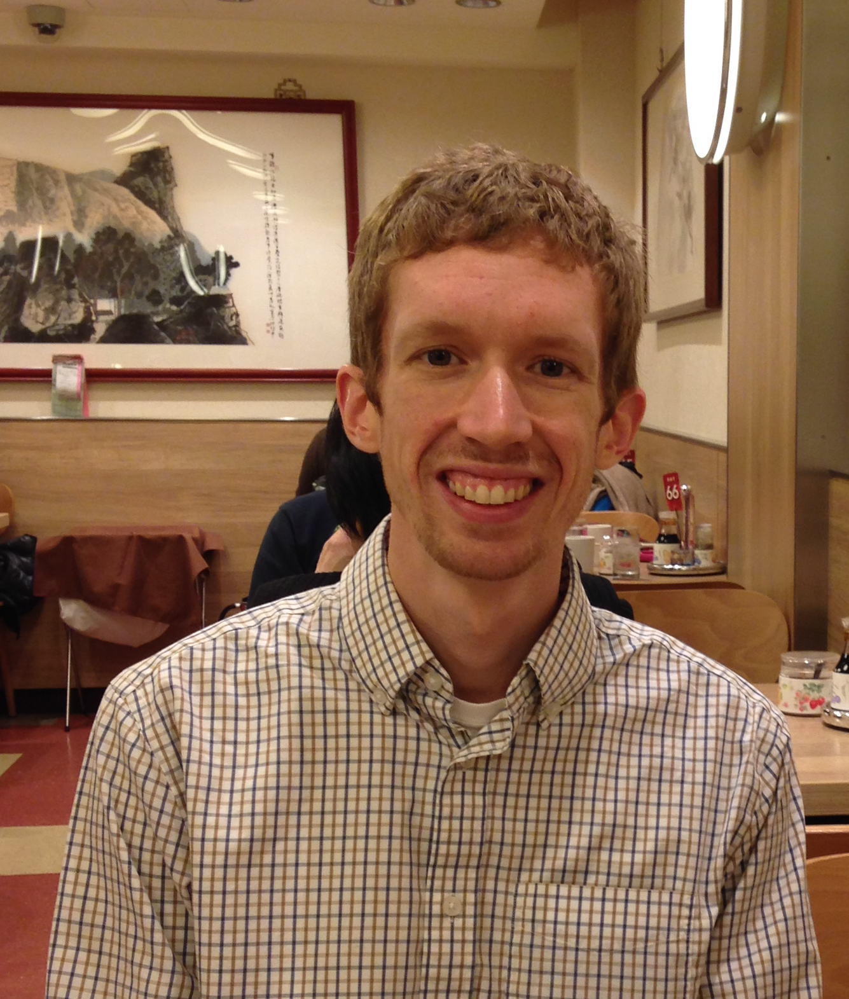

**Home** /
[Research](research.html) /
[Curriculum Vitae](cvitae.html) /
[Publications](publications.html) /
[Blog](blog.html)

***

  

  

### Joseph Clampitt

  Dept. of Physics and Astronomy\
  University of Pennsylvania\
  <joseph.clampitt@gmail.com>\
  (215) 898-7942

  

  

  
  

  
  

I am a postdoctoral researcher in Cosmology and Astrophysics working with Prof. Bhuvnesh Jain at the University of Pennsylvania.
My research focuses on statistical measurements of galaxy, void, and filament properties using gravitational lensing, with both Sloan Digital Sky Survey (SDSS) and Dark Energy Survey (DES) data.
I've also written my own void finding algorithm and measured void abundances and clustering in SDSS and DES.
In addition to lensing data analysis, I have proposed several tests to distinguish between General Relativity and alternative gravity models.
I describe my research in plain English [here](research.html).

I recently started a blog with research tips for science PhD students, [sciencephdguide.com](http://sciencephdguide.com/phd-guide/)

This article in [Nautilus](http://nautil.us) featured my work on weak lensing of cosmic voids:\
[What's 250 Million Light-Years Big, Almost Empty, and Full of Answers?](http://nautil.us/issue/16/nothingness/whats-250-million-light_years-big-almost-empty-and-full-of-answers)  
and this article describes my lensing measurements of voids and filaments:\
[Cosmologists Weigh Cosmic Filaments and Voids](http://www.upenn.edu/pennnews/news/cosmologists-penn-weigh-cosmic-filaments-and-voids)

