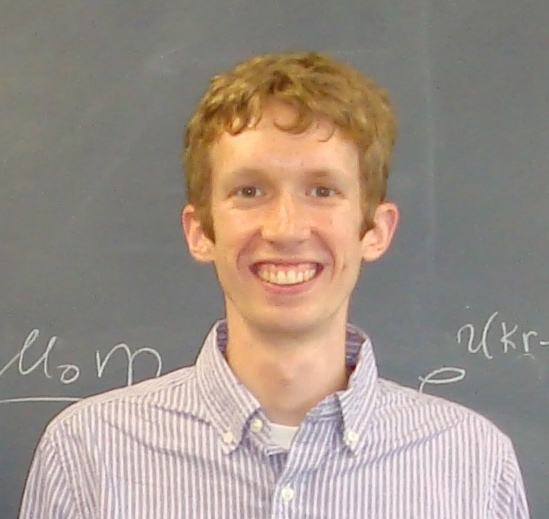

**Home** /
[Research](research.html) /
[Catalogs](catalogs.html) /
[Curriculum Vitae](cvitae.html) /
[Publications](publications.html) /
[Blog](blog.html)

***

  

  

### Joseph Clampitt

  PhD in Physics and Astronomy\
  University of Pennsylvania\
  <joseph.clampitt@gmail.com>

  List of [technical publications](publications.html)
  

  

  
  

  
  

 

I am a postdoctoral researcher in Cosmology and Astrophysics, formerly at the University of Pennsylvania.
My research focuses on statistical measurements of galaxy, void, and filament properties using gravitational lensing, with both Sloan Digital Sky Survey (SDSS) and Dark Energy Survey (DES) data.
I've also written my own void finding algorithm and measured void abundances and clustering in SDSS and DES.
In addition to lensing data analysis, I've proposed several tests to distinguish between General Relativity and alternative gravity models.

For non-technical descriptions of my research see the following articles:

1. [Why Nothing Really Matters](http://discovermagazine.com/2016/dec/nothing-really-matters) in [Discover Magazine](http://discovermagazine.com).
2. [What's 250 Million Light-Years Big, Almost Empty, and Full of Answers?](http://nautil.us/issue/16/nothingness/whats-250-million-light_years-big-almost-empty-and-full-of-answers) in [Nautilus](http://nautil.us). 
3. [Cosmologists Weigh Cosmic Filaments and Voids](http://www.upenn.edu/pennnews/news/cosmologists-penn-weigh-cosmic-filaments-and-voids) in [Penn News](https://news.upenn.edu).

Through my blog, [sciencephdguide.com](http://sciencephdguide.com), I teach research skills to PhD students.

