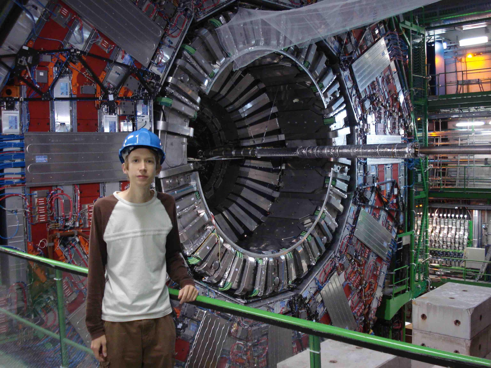

[Home](index.html) /
**Research** / 
[Curriculum Vitae](cvitae.html) / 
[Publications](publications.html) /
[Blog](blog.html)

***

## Research

This page has background information on the research areas in which I work.
I've also given a brief description of my own work on each topic, and cross-referenced my papers at the bottom of each section.

### Gravitational Lensing

Light bends as it passes through a lens or prism.
This has practical value: eyeglasses, cameras, and microscopes have improved our lives.
It also has aesthetic value: the colors of a rainbow are produced when white sunlight is split by moisture in the air.
These are familiar examples of lensing, but surprisingly it is not only water and glass that can deflect light -- all the mass in the universe can.

The sketch to the right shows an alignment of foreground galaxies and dark matter "lenses" (black circles) between more distant galaxies (yellow ovals) and the observer's telescope.
In this configuration, the light from the distant background galaxies is bent as it passes the foreground galaxies.
This causes the background galaxy image to shift to a slightly different location on the sky.
In addition, the image is deformed, as shown in the second sketch below.
Background galaxy images (thin lines) are squashed along the line joining them to the foreground lens (black circle).
This imprints a barrel pattern on the field of galaxies behind large galaxies.
The effect is exaggerated in this sketch: the actual change in shape of the images is usually a few percent or less.

More distortion of background galaxies implies a more massive foreground lens.
By comparing the strength of the barrel pattern between sources that appear close to and far from the lens, the detailed shape of the lens can also be determined.
In addition to measuring lens galaxy properties in this way, I've used variations of this technique to detect dark filaments connecting galaxies, empty spaces in the galaxies called voids, and more:\
[Filament lensing](http://arxiv.org/abs/1402.3302)\
[Void lensing](http://arxiv.org/abs/1404.1834)\
[Elliptical halo lensing](http://arxiv.org/abs/1506.03536)\
[Galaxy cluster lensing](http://arxiv.org/abs/1405.4285)\
[Cosmological lensing](http://arxiv.org/abs/1507.05552)

### Cosmic Voids

Galaxy clusters are the most massive objects in the universe, with a typical one weighing 100 times more than our own galaxy, the Milky Way.
The typical radii of such clusters are easily five times larger than the Milky Way's, but even these giants are dwarfed by cosmic voids.
A single void is big enough that hundreds of galaxy clusters could fit inside -- but then it wouldn't be called a void.

Voids have expelled most of their gas and other matter, feeding the network of galaxies and filaments at their edges.
While voids take up most of the space of the known universe, they are by nature very dark and difficult to study.
Gravitational lensing of distant background galaxies provides a way around this difficulty, since it doesn't rely on finding galaxies within the voids themselves.
In contrast to galaxy lensing (pictured in the previous section), void lensing imprints a pincushion pattern on background galaxies.
I wrote a void finding algorithm and then measured this pincushion pattern around about 10,000 voids in the [Sloan Digital Sky Survey](http://www.sdss.org) (SDSS).
The resulting void map is shown in the above diagram for a single patch on the sky: by definition the voids (green circles) extend to the edges of the galaxies (black points).
My lensing measurement of these voids provided the first direct constraints on void shapes (pictured below):  they are flat and empty at the center with a sharp rise back to the universe's average mass density at the void edge.

In addition to being interesting objects in their own right, voids may help us learn something about fundamental physical laws.
The universe has only recently experienced accelerating expansion due to a mysterious "dark energy."
Dark energy has a nearly uniform density throughout the universe: it fills galaxies and voids equally.
But since voids have much less normal matter, dark energy is relatively more important and easier to measure in voids.
Furthermore, many theories of modified gravity (see the following section) disagree most strongly with General Relativity in low density regions -- like voids.
Finally, by combining void lensing with measurements of void clustering (the tendency for voids to come in bunches) we can better understand cosmology, the study of the shape and size of the universe as a whole.
These are my papers which go into more detail about my void finder, void measurements, and voids as probes of fundamental physics:\
[Void finder and lensing](http://arxiv.org/abs/1404.1834)\
[Void clustering](http://arxiv.org/abs/1507.08031)\
[Modified gravity in voids I](http://arxiv.org/abs/1212.2216) and [Modified gravity in voids II](http://arxiv.org/abs/1408.5338)

### Modified Gravity

\

Einstein's theory of General Relativity (GR) has passed numerous empirical tests.
Years before gravitational lensing and the precession of mercury's orbit were discovered, they were predicted by this theory.
But it may have a major theoretical flaw: the expansion of the universe has to be put into the theory by hand.
"Modified Gravity" (MG) models attempt to account for the expansion more naturally, but many cannot at the same time pass the same empirical tests as GR.
The simple force law of GR in the first equation above describes the gravitational force between two objects based simply on the mass of both and their separation.
In contrast, MG models predict an additional "fifth force."
This extra force is a necessary consequence of the theory being designed to both account for dark energy and pass empirical tests.
One example of such a fifth force is shown in the second equation above.
The new force depends on the ambient density: the attraction between two objects is much stronger if they are located in the middle of empty space rather than at the center of a galaxy cluster.

Thus this fifth force is only activated in the smallest stars and galaxies, nearly invisible gas clouds, and voids.
Since we need light in order to do astronomy, it is difficult to obtain the detailed measurements of these objects needed to distinguish between GR and MG theories.
I've worked on modeling the effects of MG on small, dim galaxies, and have described simple tests which use weak lensing of background galaxies to minimize the need for high signal-to-noise data inside the galaxy.
In addition I've modeled the effects of MG on the number of voids in the universe: since this test only requires counting the number of voids, it also avoids the need for data within the void itself.
Predictions for these tests are described in more detail in the following papers:\
[Galaxies in MG](http://arxiv.org/abs/1110.2177)\
[Void abundance in MG I](http://arxiv.org/abs/1212.2216)\
[Void abundance in MG II](http://arxiv.org/abs/1408.5338)\

### Dark Energy Survey Telescope

For the measurements above I mostly relied on archival [Sloan Digital Sky Survey](http://www.sdss.org) (SDSS) data, taken from 2000 -- 2008 at Apache Point Observatory in New Mexico.
That data set is enormous, comprising tens of millions of galaxies, but the ongoing [Dark Energy Survey](http://www.darkenergysurvey.org) (DES) at Cerro Tololo Inter-American Observatory in Chile will surpass it.
DES is a five year survey that will cover a quarter of the southern sky to great depth, allowing measurements of much more distant galaxies than SDSS.

More distant galaxies are affected more strongly by gravitational lensing.
This means the lensing measurements I carried out with SDSS can be improved with the new DES data -- leading to a better understanding of galaxies, voids, filaments, and gravity.
Since 2012 I've been involved with detailed testing of DES simulations and Science Verification (SV) data.
A map of the SV data set (from Jarvis et al. 2015) is shown above.
Since 2013 I've coordinated the DES "galaxy-galaxy lensing" analysis team, which carries out gravitational lensing tests and measurements like those described in the Gravitational Lensing section above.
In 2014 the DES collaboration produced our first science results, and since then new papers have been released at a rapid pace.
Here are some that I was involved in:\
[Galaxy cluster lensing](http://arxiv.org/abs/1405.4285)\
[Cosmological lensing](http://arxiv.org/abs/1507.05552)\
[Simulations and lensing](http://arxiv.org/abs/1507.05353)

### High-Energy Collider Experiments

As an undergraduate I worked mostly on high-energy physics experiments, primarily the [Compact Muon Solenoid](http://cms.web.cern.ch) (CMS) detector at [CERN](http://home.cern).
The expensive hardware of the detector is positioned very close to the destructive energy of the [Large Hadron Collider](http://home.cern/topics/large-hadron-collider) (LHC) proton beam.
Careful testing is a must to prevent damage.
I was involved in software development for the Beam Conditions and Radiation Monitoring System as well as Quality Control of the Forward Pixel detector hardware.
The highlight was a summer working onsite at CERN, on the border of France and Switzerland.
This picture shows me in front of the CMS detector, shortly before the underground tunnel was sealed off to begin the experiment.

